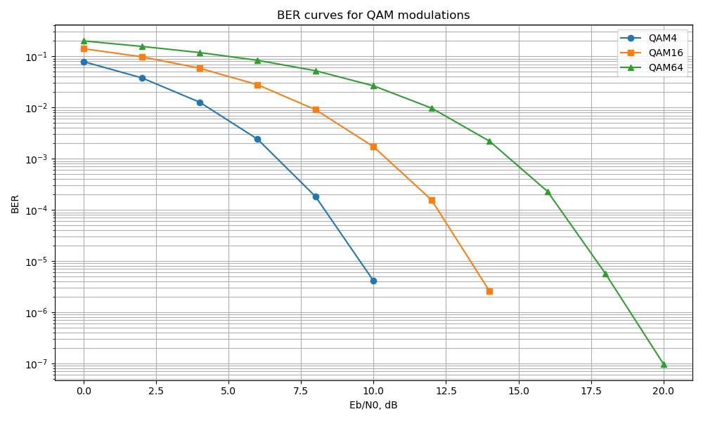

# Моделирование QAM-модуляции в канале с гауссовским шумом

## Цель работы

Реализовать на C++ последовательную модель передачи битовой последовательности через QAM-модулятор, канал с аддитивным гауссовским шумом и QAM-демодулятор.

Рассматриваемые типы модуляции:

- QPSK / QAM4
- QAM16
- QAM64

## Описание реализации

В программе реализованы следующие классы:

- `Modulator` — выполняет преобразование битовой последовательности в QAM-символы;
- `GaussianNoiseAdder` — добавляет к комплексным символам гауссовский шум;
- `Demodulator` — выполняет восстановление битовой последовательности по принятым символам.

### Алгоритмы демодуляции


#### Жесткое декодирование по минимальной норме
Поиск ближайшего к созвездию элемента

$$\hat{s} = arg \min_{s_i \in S}|y - s_i|^2$$

#### LLR через сумму экспонент
Нахождеие оптимального элемента по ML критерию

$$LLR(b_k) = ln \frac{\sum_{s_i \in S_k^0} \exp(-\frac{|y - s_i|^2}{2\sigma^2})}{\sum_{s_i \in S_k^1} \exp(-\frac{|y - s_i|^2}{2\sigma^2})}$$

#### LLR через Max-Log approximation

Тоже самое что и сумма экспонент, но с аппроксимацией логарифма

$$LLR(b_k) = \frac{\min_{s_i \in S_k^1}|y - s_i|^2 -  \min_{s_i \in S_k^0}|y - s_i|^2}{2\sigma^2}$$


### Модель канала

Передача моделируется по схеме:

```text
bits -> QAM modulation -> AWGN channel -> QAM demodulation -> BER calculation
```
### Результаты

Далее представленны результаты моделирования полученные с помощью метода Монте-Карло. Демодулирование производилось с жесткими решениями по методу минимального расстояния


